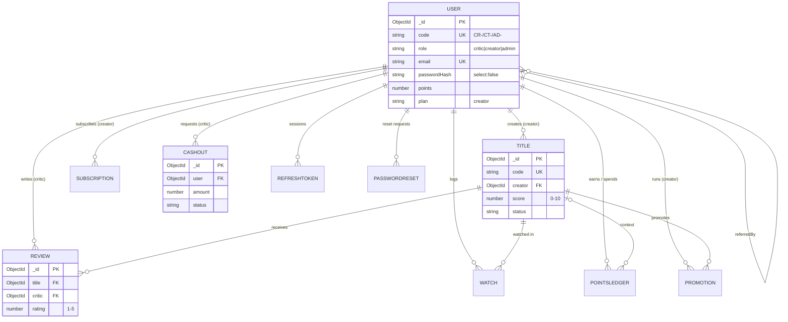

# CritiFlix — Database Schema

**Engine:** MongoDB · **ODM:** Mongoose 8 · **14 collections**

This document is the source of truth for the data model. It is generated to match
the Mongoose schemas in `server/src/models/` exactly. Every model uses Mongoose
`timestamps` (so `createdAt` / `updatedAt` exist) unless noted, and every document
has the implicit `_id: ObjectId` primary key.

---

## 1. Conventions

| Convention | Detail |
|---|---|
| Primary key | Mongoose `_id` (`ObjectId`) on every document. |
| Foreign keys | `ObjectId` with `ref` to another model; populated via Mongoose `.populate()`. |
| Human codes | User-facing IDs like `CR-2041`, `CT-0188`, `TT-9F3K2A` live alongside `_id` in a `code` field. |
| Money | Naira (₦) integers. `points` are whole numbers; `1 point = ₦1` on redemption. |
| Timestamps | `createdAt` / `updatedAt` auto-managed. `PointsLedger` keeps `createdAt` only (append-only). |
| Enums | Status/role/method fields are constrained by Mongoose `enum`. |
| Secrets | `passwordHash` is `select:false`; refresh/reset tokens are stored only as SHA-256 hashes. |

### Entity relationship diagram

---

## 2. Collections

### 2.1 `users`
One document per critic, creator (studio) or admin. Critic-only and creator-only
fields coexist on the same schema; which apply depends on `role`.

| Field | Type | Required | Default | Index | Notes |
|---|---|---|---|---|---|
| code | String | — | generated | **unique** | `CR-####` / `CT-####` / `AD-####` |
| role | String | ✅ | — | yes | `critic` \| `creator` \| `admin` |
| name | String | ✅ | — | — | trimmed |
| email | String | ✅ | — | **unique** | lowercased, trimmed |
| passwordHash | String | ✅ | — | — | bcrypt; `select:false` (never returned) |
| emailVerified | Boolean | — | `false` | — | |
| avatarColor | String | — | `#13294B` | — | critics seeded red, creators navy |
| status | String | — | `active` | — | `active` \| `pending` \| `verified` \| `banned` |
| **points** | Number | — | `0` | — | critic redeemable balance (min 0) |
| followers | Number | — | `0` | — | critic |
| rank | String | — | `Bronze Critic` | — | critic tier label |
| rankNo | Number | — | `null` | — | leaderboard position |
| referralCode | String | — | — | **unique, sparse** | critic invite code |
| referredBy | ObjectId→User | — | `null` | — | self-reference |
| **channelUrl** | String | — | `null` | — | creator YouTube/stream channel |
| otherUrl | String | — | `null` | — | creator secondary link |
| country | String | — | `Nigeria` | — | creator |
| genre | String | — | `null` | — | creator primary genre |
| logoUrl | String | — | `null` | — | creator production logo |
| plan | String | — | `starter` | — | `starter` \| `pro` \| `studio` |
| planRenews | Date | — | `null` | — | next renewal date |
| balance | Number | — | `0` | — | creator earnings (₦) |
| lastLoginAt | Date | — | `null` | — | set on login |
| createdAt / updatedAt | Date | auto | — | — | |

**Statics / methods:** `User.hashPassword(plain)` → bcrypt hash · `user.verifyPassword(plain)` → bool · `user.toPublic()` → document without `passwordHash`.

---

### 2.2 `titles`
A film submitted by a creator: a 3-minute trailer plus a link to the full movie.

| Field | Type | Required | Default | Index | Notes |
|---|---|---|---|---|---|
| code | String | — | generated | **unique** | `TT-XXXXXX` |
| creator | ObjectId→User | ✅ | — | yes | owning studio |
| title | String | ✅ | — | — | trimmed |
| synopsis | String | — | `''` | — | `maxlength 4000`; ≤500 words enforced in controller |
| genre | String | — | `Drama` | yes | |
| runtime | String | — | `''` | — | e.g. `1h 52m` |
| trailerUrl | String | ✅ | — | — | uploaded ≤3-min trailer (`/uploads/…`) or external URL |
| movieUrl | String | ✅ | — | — | full film (critics are redirected here) |
| trailerDurationSec | Number | — | `null` | — | enforced ≤180s (3 min) at upload |
| trailerSizeBytes | Number | — | `null` | — | enforced ≤200MB at upload |
| posterSmall | String | — | `null` | — | ~360w thumbnail (Browse lists) |
| posterLarge | String | — | `null` | — | ~800w thumbnail (detail hero) |
| status | String | — | `reviewing` | yes | `draft` \| `reviewing` \| `scored` \| `ended` |
| score | Number | — | `null` | **desc** | aggregate /10 (`min 0, max 10`) |
| reviewCount | Number | — | `0` | — | |
| watchCount | Number | — | `0` | — | completed watches (feeds trending rank) |
| watchPoints | Number | — | `100` | — | points a critic earns for watching |
| featured | Boolean | — | `false` | yes | admin-set top placement |
| priorityBoost | Number | — | `0` | — | admin-set ranking nudge |
| tags | [String] | — | `[]` | — | |
| createdAt / updatedAt | Date | auto | **desc** | — | |

---

### 2.3 `reviews`
A critic's rating + written review of a title. **One review per critic per title.**

| Field | Type | Required | Default | Index | Notes |
|---|---|---|---|---|---|
| title | ObjectId→Title | ✅ | — | yes | |
| critic | ObjectId→User | ✅ | — | yes | |
| rating | Number | ✅ | — | — | stars, `min 1, max 5` |
| score | Number | ✅ | — | — | `rating × 2` → /10 (`min 0, max 10`) |
| headline | String | — | `''` | — | |
| body | String | — | `''` | — | |
| tags | [String] | — | `[]` | — | aspect tags (Pacing, Score…) |
| createdAt / updatedAt | Date | auto | — | — | |

**Compound unique index:** `{ title: 1, critic: 1 }`.

---

### 2.4 `watches`
Records a completed watch and acts as the **idempotency guard** so watch points
are awarded only once per (critic, title).

| Field | Type | Required | Default | Index | Notes |
|---|---|---|---|---|---|
| critic | ObjectId→User | ✅ | — | yes | |
| title | ObjectId→Title | ✅ | — | yes | |
| createdAt / updatedAt | Date | auto | — | — | |

**Compound unique index:** `{ critic: 1, title: 1 }`.

---

### 2.5 `pointsledgers`
Append-only audit trail of every points movement. Balances on `users.points` are
derived from / reconciled against this ledger.

| Field | Type | Required | Default | Index | Notes |
|---|---|---|---|---|---|
| user | ObjectId→User | ✅ | — | yes | |
| type | String | ✅ | — | — | `watch` \| `review` \| `rating` \| `referral` \| `redeem` \| `adjustment` |
| points | Number | ✅ | — | — | **signed** (+earn / −spend) |
| ref | String | — | `''` | — | human description (title name, payout destination) |
| title | ObjectId→Title | — | `null` | — | optional context |
| balanceAfter | Number | — | `null` | — | snapshot of `user.points` after the entry |
| createdAt | Date | auto | — | **compound** | no `updatedAt` (immutable) |

**Compound index:** `{ user: 1, createdAt: -1 }` (fast per-user history).

---

### 2.6 `subscriptions`
Creator subscription record / history. The *current* plan is also denormalised
onto `users.plan` for fast reads; this collection is the source of truth.

| Field | Type | Required | Default | Index | Notes |
|---|---|---|---|---|---|
| creator | ObjectId→User | ✅ | — | yes | |
| plan | String | ✅ | — | — | `starter` \| `pro` \| `studio` |
| price | Number | ✅ | — | — | ₦/mo at purchase |
| status | String | — | `active` | yes | `pending` \| `active` \| `canceled` \| `past_due` |
| provider | String | — | `manual` | — | `paystack` \| `manual` |
| providerRef | String | — | `null` | — | gateway reference |
| reference | String | — | `null` | — | Paystack transaction reference (matched by webhook) |
| startedAt | Date | — | `Date.now` | — | |
| renewsAt | Date | — | `null` | — | |
| canceledAt | Date | — | `null` | — | |
| createdAt / updatedAt | Date | auto | — | — | |

---

### 2.7 `promotions`
A paid boost across WhatsApp / Facebook / the in-app feed.

| Field | Type | Required | Default | Index | Notes |
|---|---|---|---|---|---|
| code | String | — | generated | **unique** | `PR-XXXXXX` |
| creator | ObjectId→User | ✅ | — | yes | |
| title | ObjectId→Title | ✅ | — | — | |
| channels | [String] | — | `[]` | — | each `whatsapp` \| `facebook` \| `feed` |
| budget | Number | — | `0` | — | ₦ total |
| spent | Number | — | `0` | — | ₦ |
| reach | Number | — | `0` | — | impressions |
| conversion | Number | — | `0` | — | % |
| status | String | — | `review` | yes | `review` \| `live` \| `ended` \| `rejected` |
| startsAt / endsAt | Date | — | `null` | — | |
| createdAt / updatedAt | Date | auto | — | — | |

---

### 2.8 `cashouts`
A critic's request to redeem points for money.

| Field | Type | Required | Default | Index | Notes |
|---|---|---|---|---|---|
| code | String | — | generated | **unique** | `CO-XXXXXX` |
| user | ObjectId→User | ✅ | — | yes | the critic |
| points | Number | ✅ | — | — | points redeemed |
| fee | Number | — | `25` | — | flat ₦ fee |
| amount | Number | ✅ | — | — | ₦ paid = `points × rate − fee` |
| method | String | ✅ | — | — | `bank` \| `mobile_money` |
| destination | String | ✅ | — | — | masked account / wallet |
| bankCode | String | — | `null` | — | Paystack bank / MMO code |
| accountNumber | String | — | `null` | — | payout account (store masked in prod) |
| recipientCode | String | — | `null` | — | Paystack transfer recipient |
| transferCode | String | — | `null` | — | Paystack transfer (matched by webhook) |
| status | String | — | `review` | yes | `review` \| `processing` \| `cleared` \| `paid` \| `rejected` \| `failed` |
| provider | String | — | `paystack` | — | `paystack` \| `manual` |
| providerRef | String | — | `null` | — | transfer reference |
| failureReason | String | — | `null` | — | set when a transfer fails |
| createdAt / updatedAt | Date | auto | — | — | |

---

### 2.9 `integrations`
Third-party connections surfaced on the admin Integrations panel.

| Field | Type | Required | Default | Index | Notes |
|---|---|---|---|---|---|
| key | String | ✅ | — | **unique** | `whatsapp` \| `facebook` \| `youtube` \| `paystack` |
| name | String | ✅ | — | — | display name |
| connected | Boolean | — | `false` | — | toggled by admin |
| meta | Mixed | — | `{}` | — | metrics: `reach30d`, `delivery`, `adSpend`, `redirects24h`… |
| createdAt / updatedAt | Date | auto | — | — | |

---

### 2.10 `refreshtokens`
One row per issued refresh token. Only the **SHA-256 hash** is stored, so a
database leak cannot be replayed. Supports rotation and auto-expiry.

| Field | Type | Required | Default | Index | Notes |
|---|---|---|---|---|---|
| user | ObjectId→User | ✅ | — | yes | |
| tokenHash | String | ✅ | — | **unique** | SHA-256 of the opaque token |
| expiresAt | Date | ✅ | — | **TTL** | `expireAfterSeconds: 0` auto-deletes |
| revokedAt | Date | — | `null` | — | set on rotation/logout |
| replacedBy | String | — | `null` | — | `tokenHash` of the successor |
| userAgent | String | — | `null` | — | device hint |
| ip | String | — | `null` | — | |
| createdAt / updatedAt | Date | auto | — | — | |

**Virtual:** `active` → `!revokedAt && expiresAt > now`.

---

### 2.11 `passwordresets`
Short-lived password-reset tokens (hashed), auto-expiring.

| Field | Type | Required | Default | Index | Notes |
|---|---|---|---|---|---|
| user | ObjectId→User | ✅ | — | yes | |
| tokenHash | String | ✅ | — | yes | SHA-256 of the emailed token |
| expiresAt | Date | ✅ | — | **TTL** | `expireAfterSeconds: 0`; 1-hour lifetime |
| usedAt | Date | — | `null` | — | set when consumed (single use) |
| createdAt / updatedAt | Date | auto | — | — | |

---

## 3. Index summary

| Collection | Unique | Compound | TTL | Other |
|---|---|---|---|---|
| users | `code`, `email`, `referralCode` (sparse) | — | — | `role` |
| titles | `code` | — | — | `creator`, `status`, `score:-1` |
| reviews | `{title,critic}` | `{title,critic}` | — | `title`, `critic` |
| watches | `{critic,title}` | `{critic,title}` | — | `critic`, `title` |
| pointsledgers | — | `{user, createdAt:-1}` | — | `user` |
| subscriptions | — | — | — | `creator`, `status` |
| promotions | `code` | — | — | `creator`, `status` |
| cashouts | `code` | — | — | `user`, `status` |
| integrations | `key` | — | — | — |
| refreshtokens | `tokenHash` | — | `expiresAt` | `user` |
| passwordresets | — | — | `expiresAt` | `user`, `tokenHash` |

---

## 4. Authentication design

CritiFlix uses **email + password** credentials with a short-lived JWT access
token and a rotating opaque refresh token.

| Element | Implementation |
|---|---|
| Password storage | bcrypt (`BCRYPT_ROUNDS`, default 10); `passwordHash` is `select:false`. |
| Access token | JWT signed with `JWT_ACCESS_SECRET`; payload `{ sub: userId, role, code }`; TTL `ACCESS_TOKEN_TTL` (default `15m`). |
| Refresh token | 48-byte random hex returned to the client; only its SHA-256 hash is persisted in `refreshtokens`; TTL `REFRESH_TOKEN_TTL_DAYS` (default 30). |
| Rotation | On `/auth/refresh` the presented token is revoked (`revokedAt`, `replacedBy`) and a new pair is issued. |
| Password reset | `/auth/forgot-password` stores a hashed token in `passwordresets` (1-hour TTL); `/auth/reset-password` consumes it and revokes all sessions. |
| Session revocation | Changing/resetting a password calls `revokeAllForUser`, deleting active refresh tokens. |

### Auth endpoints

| Method & path | Auth | Body | Purpose |
|---|---|---|---|
| `POST /api/auth/register` | public | `name, email, password, role, [channelUrl…], [referredByCode]` | Create a critic or creator; returns user + tokens. |
| `POST /api/auth/login` | public | `email, password` | Verify credentials; returns user + tokens. |
| `POST /api/auth/refresh` | public | `refreshToken` | Rotate tokens. |
| `POST /api/auth/logout` | public | `refreshToken` | Revoke a refresh token. |
| `GET  /api/auth/me` | access token | — | Current user (`toPublic`). |
| `POST /api/auth/forgot-password` | public | `email` | Issue a reset token (returns `devToken` outside production). |
| `POST /api/auth/reset-password` | public | `token, password` | Set a new password; revoke sessions. |
| `POST /api/auth/change-password` | access token | `currentPassword, newPassword` | Change password; revoke sessions. |

Role gating: `protect()` loads the user from the access token and blocks `banned`
accounts; `requireRole('admin'|'creator'|'critic')` guards role-specific routes.

---

## 5. Payments (Paystack)

Subscriptions and cashouts integrate with **Paystack**. When `PAYSTACK_SECRET_KEY`
is unset, every payment call is **simulated** so the flows work end-to-end in dev;
setting the key switches to the live API with no code changes.

| Flow | How it works |
|---|---|
| Subscribe | `POST /api/me/subscribe` creates a `pending` Subscription with a `reference`, then calls Paystack `transaction/initialize` and returns a `checkoutUrl`. The plan activates when the `charge.success` webhook arrives (or immediately in simulated mode). |
| Cashout | `POST /api/me/redeem` debits points and creates a `review` Cashout (with optional `bankCode`/`accountNumber`). An admin `POST /api/admin/cashouts/:id/pay` creates a transfer recipient and calls Paystack `transfer`; the `transfer.success`/`failed` webhook moves it to `paid`/`failed` (a failed transfer refunds the critic's points). |
| Webhook | `POST /api/webhooks/paystack` verifies the `x-paystack-signature` (HMAC-SHA512 of the raw body with the secret key) before processing. Mounted before the JSON body parser so the raw bytes are available. |

Config endpoint `GET /api/config` reports `{ payments: { paystack: <bool>, publicKey } }`.

---

## 6. Economy & plan configuration

Defined in `server/src/points.js` (single source of truth).

**Earning (points)** — `watch +120`, `review +80`, `rating +20`, `referral +250`.
**Redemption** — `1 point = ₦1`; flat `₦25` cashout fee.

| Plan | ₦/mo | Active titles | Promotions | Featured |
|---|---|---|---|---|
| Starter | 0 | 1 | — | — |
| Pro | 7,500 | 10 | ✅ | ✅ |
| Studio | 20,000 | Unlimited | ✅ | ✅ |

---

## 7. Seed data & admin bootstrap

`npm run seed` clears all collections and creates **only the admin account** plus the
service-connector rows. No demo critic/creator accounts, titles or sample activity are
created — real users sign up through the app.

| Setting | Source |
|---|---|
| Admin email | `ADMIN_EMAIL` (default `admin@critiflix.app`) |
| Admin name | `ADMIN_NAME` (default `CritiFlix Admin`) |
| Admin password | `ADMIN_PASSWORD` (auto-generated and printed if unset) |

---

## 8. Operational notes

- **Auto-indexing** is on in development (`autoIndex: !isProd`). In production, build
  indexes during deploy and set `autoIndex:false` to avoid runtime overhead.
- **Buffering is disabled** (`bufferCommands:false`) so that when MongoDB is
  unreachable, DB-backed routes fail fast and the API returns a clean `503` rather
  than hanging. `GET /api/health` reports `db: connected | down`.
- **Denormalisation:** `users.plan`/`planRenews` mirror the latest `subscriptions`
  row, and `titles.score`/`reviewCount` are recomputed on each new review — trading
  a little write cost for fast reads on hot paths.

---

## 9. Update — eligibility, dynamic points, payouts, watch-gate, OTP, follows

This release extends the model. Three new collections were added (**14 total**) and
several existing documents gained fields.

### 9.1 New & changed fields

**`users`** gained:

| Field | Type | Notes |
|---|---|---|
| `phone` | String (sparse, indexed) | For phone OTP. |
| `phoneVerified` | Boolean | Set true after a phone OTP verify. |
| `following` | Number | How many accounts this user follows. |
| `reviewCount` | Number | Published reviews — counts toward earning eligibility. |

`followers` (already present) now reflects the real follow graph in `follows`.

**`watches`** gained per-title progress so watch points only pay out once a critic
has actually watched ≥ 75% of the film:

| Field | Type | Notes |
|---|---|---|
| `watchedSeconds` | Number | Furthest point reached in the in-app player. |
| `durationSeconds` | Number | Film length reported by the player. |
| `percent` | Number (0–1) | `watchedSeconds / durationSeconds`. |
| `completed` | Boolean | Crossed the 75% gate → review unlocked. |
| `awarded` | Boolean | Watch points already granted (idempotency). |

**`titles`** gained `runtimeMinutes` (Number) — the parsed film length that, with the
creator's plan, determines the title's `watchPoints` (50–150).

### 9.2 `follows`

| Field | Type | Constraints |
|---|---|---|
| `follower` | ObjectId → User | required, indexed |
| `following` | ObjectId → User | required, indexed |
| `createdAt` / `updatedAt` | Date | auto |

Unique compound index `{ follower, following }` prevents duplicate follows.

### 9.3 `otps`

| Field | Type | Constraints |
|---|---|---|
| `channel` | String enum `email\|phone` | required |
| `destination` | String (lowercased) | required, indexed |
| `codeHash` | String | SHA-256 of the 6-digit code |
| `attempts` | Number | max 5 before invalidation |
| `consumed` | Boolean | one-time use |
| `expiresAt` | Date | TTL index — auto-purged 10 min after issue |

### 9.4 `announcements`

| Field | Type | Constraints |
|---|---|---|
| `audience` | String enum `all\|critics\|creators` | indexed |
| `title` | String | required |
| `body` | String (≤2000) | required |
| `channel` | String enum `in_app\|whatsapp\|email` | default `in_app` |
| `createdBy` | ObjectId → User | admin author |

### 9.5 Economy rules (in `server/src/points.js`)

| Rule | Value |
|---|---|
| Earn/cashout eligibility | ≥ **200 followers** AND ≥ **1000 reviews** |
| Per-title watch points | `planBase{starter 50, pro 90, studio 120} + min(len,60)·0.5`, clamped **50–150** |
| Watch gate before review | **75%** of the film (tracked in-app) |
| Payout pool | **50%** of active-subscription revenue; cashouts can't exceed the remaining pool |
| Redemption | 1 pt = ₦1, flat ₦25 cashout fee |

---

## V15 feature update — schema changes

**User** — added `whatsapp` (String, sparse index; required at registration, used for promotions/alerts) and `avatarUrl` (String; uploaded profile picture).

**Title** — `status` enum extended to `['draft','pending','reviewing','scored','ended','delisted']`. New titles are created as **`pending`** and are only visible to users (Browse + detail) once an admin sets them to `reviewing` (**approve**). `delisted` hides a title for suspected violations; `relist` returns it to `reviewing`. Creators may edit their own title properties without re-approval.

**Watch** — added `cumulativeSeconds` (real watched time), `lastPlayhead`, and `lastReportAt`. Watch credit is metered by wall-clock between progress reports, so scrubbing/fast-forwarding cannot reach the 75% review gate.

**Notification** (new) — `{ user, type[new_title|promo|system|title_status], title, body, data, read }`. Fanned out to critics when a title is approved, and to the chosen audience for in-app and WhatsApp promotions. Endpoints: `GET /api/notifications`, `GET /api/notifications/unread-count`, `POST /api/notifications/read`.

**Points** — review/rating points are awarded only on a critic's **first** review of a title (idempotent via PointsLedger check); repeat reviews yield no points.

**Admin** — `GET /api/admin/titles/:id` (full properties for approval), `POST /api/admin/titles/:id/{approve|delist|relist}`, and `POST /api/admin/promotions/whatsapp` (returns recipient `wa.me` click-to-chat links; real delivery requires the WhatsApp Business API).
